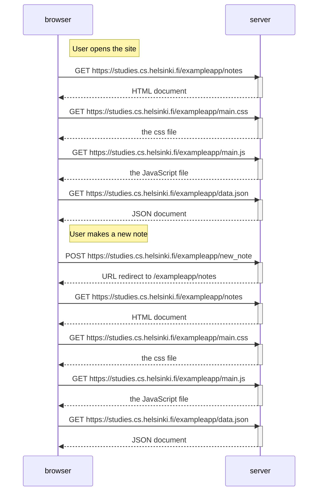

# 0.4: uusi muistiinpano

## Tehtävänanto

Tee vastaavanlainen kaavio, joka kuvaa, mitä tapahtuu tilanteessa, jossa käyttäjä luo uuden muistiinpanon ollessaan sivulla https://studies.cs.helsinki.fi/exampleapp/notes eli kirjoittaa tekstikenttään jotain ja painaa nappia tallenna.

## Vastaus

